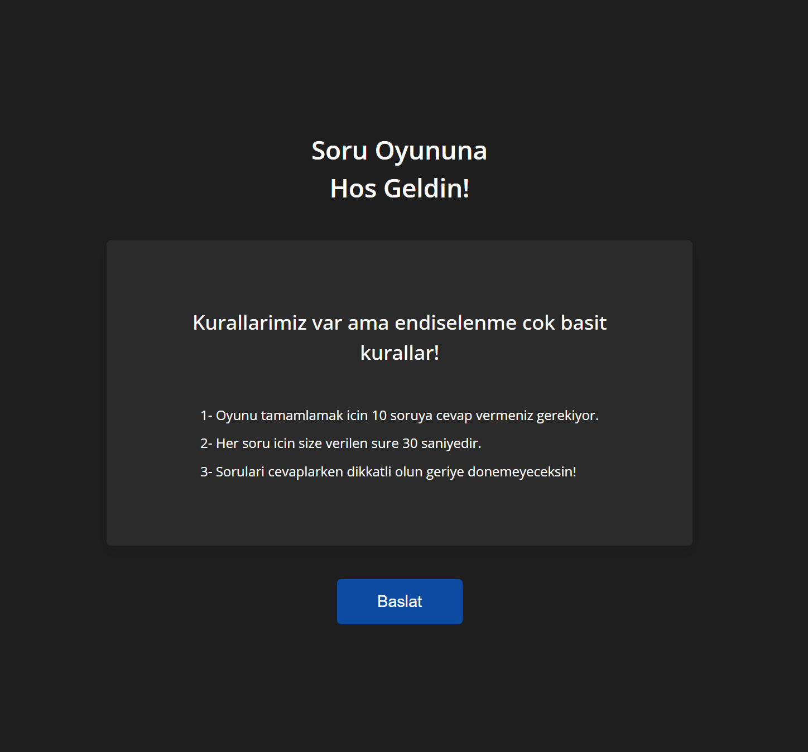

# QUESTION APP

## Description

This project is a question practice game. In this game you have 30 seconds for each question. When the questions appear on the screen, you cannot see the answer choices for the first 4 seconds! After 4 seconds you can choose one of the answers. Be careful when choosing the answers because you cannot go back to the old question. Each question is worth 10 points and you can collect 100 points in total. At the end of the questions you can also find the answers if you want.

## Technologies

- HTML
- CSS
- React JS

## Live Site

[You can also click if you want to see the site live.](https://questionapp-rk.netlify.app/)

## Screenshots

### Developer: [Rıdvan Kesken](https://www.linkedin.com/in/ridvankesken/)
